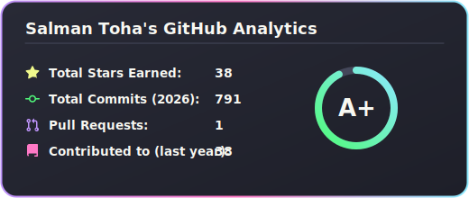
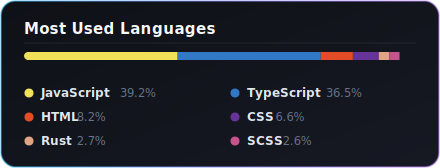
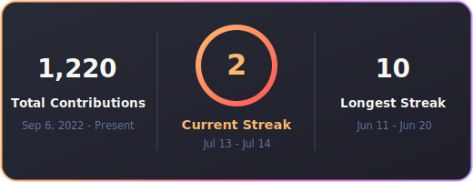
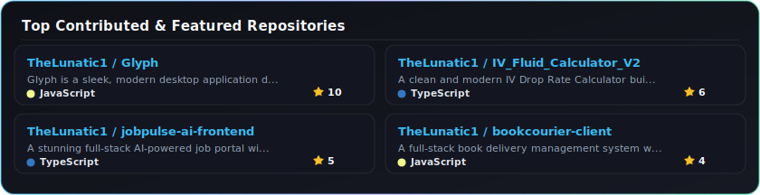

<h1 align="center">
  
  
  
</h1>

<h3 align="center">Full Stack Developer | Mobile Dev | DevOps & AI Architect</h3>

  
  
  

  

 

---

##  About Me & Architecture Vision

I am a **Full Stack Developer & Systems Architect** from Dhaka, Bangladesh 🇧🇩. I specialize in building highly responsive, scalable, and resilient applications bridging cutting-edge **MERN Stack**, **React Native**, **DevOps CI/CD**, and **AI/ML solutions**.

-  **Core Mastery:** Specialized in **MERN Stack** (MongoDB, Express, React, Node.js), **React Native**, and **Modern Web Systems**.
-  **DevOps & Cloud:** Designing automated CI/CD workflows, Docker containerization, Linux systems (KVM/QEMU), Nginx reverse proxying, and server orchestration.
-  **Currently Expanding:** Deep diving into **CI/CD, DevOps**, **High-Availability Server Management**, and **Cloud Infrastructure**.
-  **Direct Contact:** `ishrak1846@gmail.com`   
- **Live Portfolio:** [salmantoha.vercel.app](https://salmantoha.vercel.app/)

 

##  Connect With Me

  
  
  
  

 

---

##  Technical Arsenal & Stack

<table>
  <tr>
    <td valign="top" width="60%">
      <h3>Frontend, Mobile & Design</h3>
      

        
        
        
        
        
        
        
        
        
      

      <h3>Backend & Systems</h3>
      

        
        
        
        
        
        
        
        
        
        
      

      <h3>DevOps & AI/Data</h3>
      

        
        
        
        
        
        
        
        
      

    </td>
    <td valign="center" align="center" width="40%">
      
    </td>
  </tr>
</table>

 

---

##  Self-Hosted GitHub Stats & Analytics

  

 

  

 

  

 

---

##  GitHub Trophies & Achievements

  

 

---

###  Daily Dev Inspiration

  

 

---

###  Top Contributed Repositories

  

 

---

  <h3>Thanks for visiting my GitHub</h3>
  

